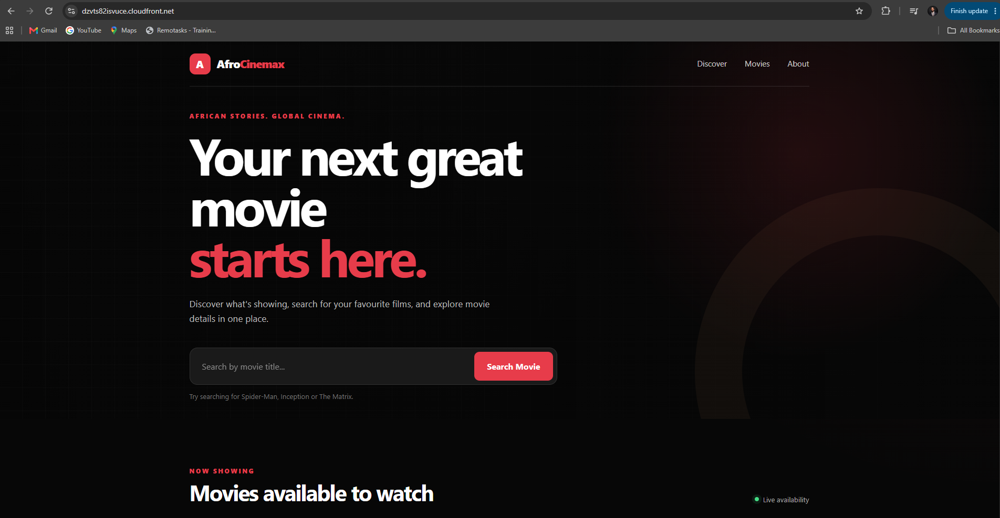
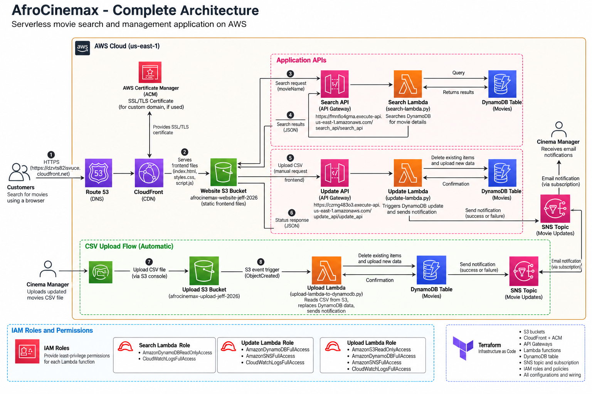
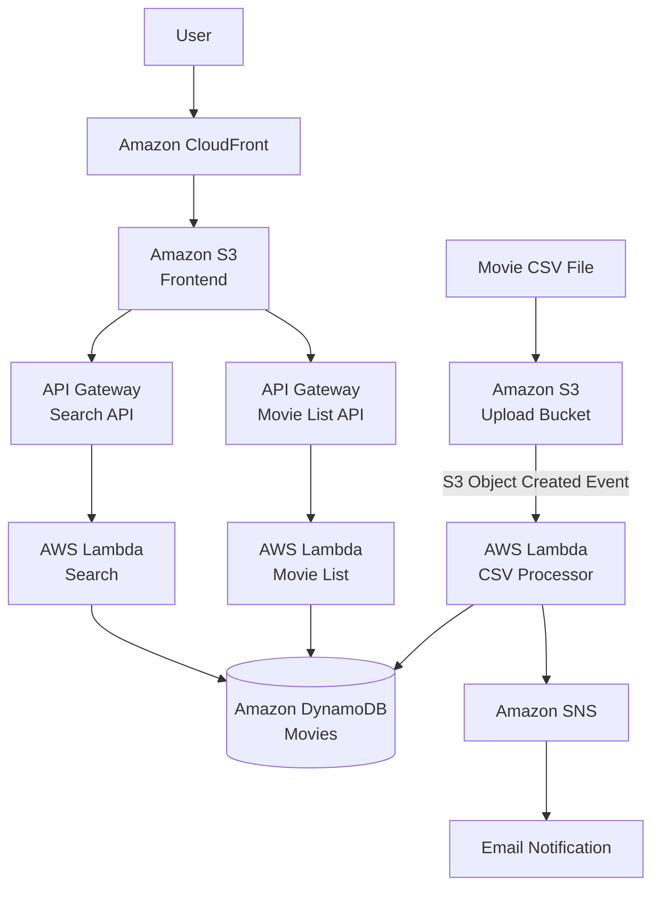
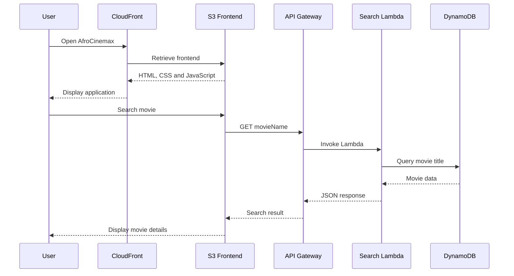
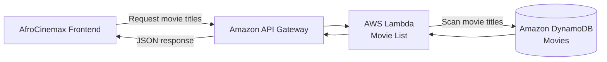
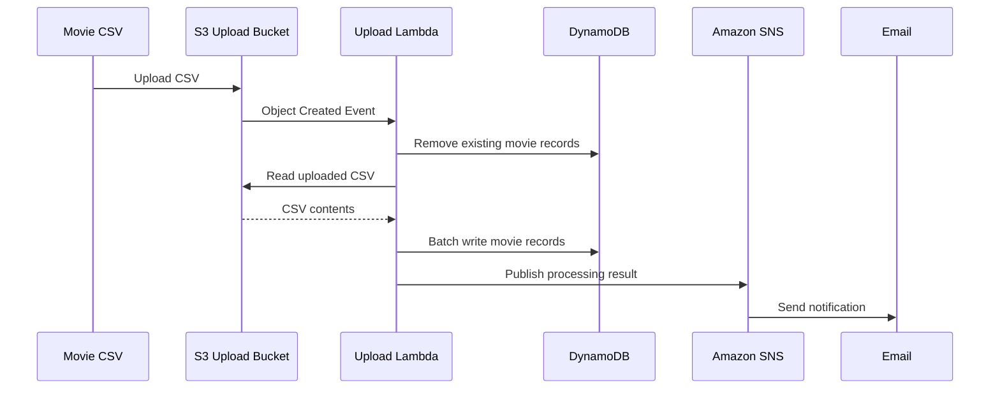
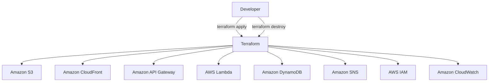
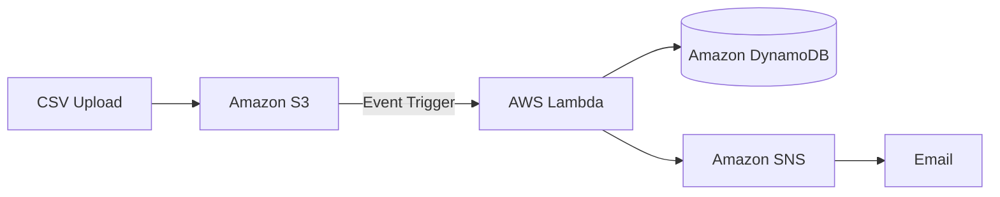

# AfroCinemax - Serverless Movies App

AfroCinemax is a serverless movie discovery application built on AWS and provisioned using Terraform.

The application allows users to browse available movie titles and search for individual movies to retrieve information such as release year, runtime, rating, and description.

The project demonstrates a complete event-driven serverless architecture using Amazon S3, CloudFront, API Gateway, AWS Lambda, DynamoDB, SNS, IAM, and CloudWatch, with the infrastructure managed as code using Terraform.

---

## Application Preview



Users can browse the available movie catalogue and search for a specific movie to retrieve its details from the serverless backend.

---

## AWS Architecture



AfroCinemax consists of two primary workflows:

- A user-facing movie discovery and search workflow
- An event-driven movie data ingestion workflow

Terraform provisions and manages the AWS infrastructure supporting both workflows.

---

## Architecture Overview



The static application is delivered through CloudFront, while API Gateway and Lambda provide the serverless application backend.

Movie data is stored in DynamoDB and can be refreshed automatically by uploading a CSV file to the designated S3 upload bucket.

---

## Movie Search Flow



When a user searches for a movie, the JavaScript frontend sends a request to API Gateway.

API Gateway invokes the search Lambda function, which queries the `Movies` DynamoDB table using the movie title as the partition key.

The matching movie information is returned as JSON and displayed by the frontend.

---

## Movie Catalogue Flow



A separate Lambda function retrieves the available movie titles from DynamoDB.

These titles are returned through API Gateway and displayed in the application, allowing users to see which movies are currently available.

---

## Movie Data Ingestion Flow



Movie data is managed through a CSV-driven ingestion pipeline.

When a CSV file is uploaded to the designated S3 upload bucket:

1. Amazon S3 generates an Object Created event.
2. The event invokes the CSV processing Lambda.
3. Existing movie records are cleared from DynamoDB.
4. Lambda reads and processes the uploaded CSV.
5. Movie records are batch-written to DynamoDB.
6. Lambda publishes the processing result to Amazon SNS.
7. SNS sends an email notification indicating whether the operation succeeded or failed.

This allows the movie catalogue to be updated without manually modifying the database.

---

## Infrastructure as Code

The entire AWS environment is provisioned using Terraform.



Terraform provides a reproducible infrastructure lifecycle, allowing the environment to be created, modified, and destroyed from configuration files rather than manually provisioning resources through the AWS Console.

---

# AWS Services

## Amazon S3

AfroCinemax uses two Amazon S3 buckets.

### Frontend Bucket

Stores the static web application:

- `index.html`
- `styles.css`
- `script.js`

The frontend is delivered to users through Amazon CloudFront.

### Movie Upload Bucket

Receives CSV files containing movie data.

Uploading a CSV object triggers the data ingestion Lambda automatically through an S3 event notification.

---

## Amazon CloudFront

Amazon CloudFront acts as the public entry point for the AfroCinemax frontend.

CloudFront retrieves the static application from the S3 origin and distributes it to users through AWS's content delivery network.

The deployment uses the CloudFront-provided HTTPS domain rather than a custom domain.

---

## Amazon API Gateway

Amazon API Gateway provides the HTTP interface between the JavaScript frontend and the Lambda backend.

The application uses API endpoints for two main operations:

### Search API

Invokes the search Lambda to retrieve information about a specific movie.

### Movie List API

Invokes the movie list Lambda to retrieve the available movie titles from DynamoDB.

API Gateway allows the frontend to communicate with the backend without exposing Lambda functions directly.

---

## AWS Lambda

Three Python Lambda functions provide the application backend.

### Search Lambda

The search Lambda receives a movie name from API Gateway and queries DynamoDB using the movie title.

It returns the corresponding movie information to the frontend as JSON.

### Movie List Lambda

The movie list Lambda scans the movie title attribute in DynamoDB and returns the available movie names.

The function handles DynamoDB pagination to ensure the complete catalogue can be retrieved as the dataset grows.

### CSV Upload Lambda

The upload Lambda is invoked automatically by an S3 Object Created event.

It:

- Reads the uploaded CSV file
- Removes existing movie records
- Processes the new movie dataset
- Batch-writes records to DynamoDB
- Publishes the processing result to SNS

---

## Amazon DynamoDB

Amazon DynamoDB provides the serverless NoSQL database used by AfroCinemax.

The application uses a table named:

```text
Movies
```

The movie title is used as the partition key:

```text
movies
```

Movie records can contain attributes such as:

```text
movies
year
time
rating
description
```

The table uses DynamoDB's on-demand billing mode, allowing capacity to scale without manually configuring provisioned read and write capacity.

---

## Amazon SNS

Amazon Simple Notification Service provides notifications for the movie ingestion workflow.

After the CSV processing Lambda completes, it publishes either a success or failure notification to the SNS topic.

The configured email subscription can then notify the administrator about the result of the data update.

---

## AWS IAM

AWS Identity and Access Management controls communication between the serverless components.

IAM roles and policies provide Lambda functions with the permissions required to interact with resources such as:

- Amazon S3
- Amazon DynamoDB
- Amazon SNS
- Amazon CloudWatch Logs

The Lambda functions use service-specific permissions instead of administrator-level access.

---

## Amazon CloudWatch

Amazon CloudWatch Logs provides observability for the Lambda backend.

Dedicated log groups capture Lambda execution information that can be used to:

- Troubleshoot failed requests
- Inspect Lambda execution
- Debug API operations
- Monitor CSV ingestion
- Investigate application errors

---

## Terraform

Terraform manages the AWS infrastructure as code.

The Terraform configuration provisions resources including:

- Amazon S3 buckets
- Amazon CloudFront distribution
- Amazon API Gateway APIs
- AWS Lambda functions
- Amazon DynamoDB table
- Amazon SNS topic and subscription
- AWS IAM roles and policies
- Amazon CloudWatch log groups
- Lambda permissions
- AWS service integrations

This makes the infrastructure reproducible and reduces the amount of manual AWS configuration required.

---

# Technology Stack

| Layer | Technology |
|---|---|
| Frontend | HTML, CSS, JavaScript |
| Backend | Python |
| Cloud Provider | AWS |
| Infrastructure as Code | Terraform |
| CDN | Amazon CloudFront |
| Object Storage | Amazon S3 |
| API Layer | Amazon API Gateway |
| Serverless Compute | AWS Lambda |
| Database | Amazon DynamoDB |
| Notifications | Amazon SNS |
| Monitoring and Logging | Amazon CloudWatch |
| Identity and Permissions | AWS IAM |
| Version Control | Git / GitHub |

---

# Project Structure

```text
AfroCinemax/
│
├── FrontEnd/
│   ├── index.html
│   ├── script.js
│   └── styles.css
│
├── Terraform-config/
│   ├── api.tf
│   ├── buckets.tf
│   ├── cloudfront.tf
│   ├── dynamodb.tf
│   ├── lambdas.tf
│   ├── provider.tf
│   └── variables.tf
│
├── images/
│   ├── afrocinemax-app.png
│   └── afrocinemax-architecture.png
│
├── movies-test-csv.csv
├── .gitignore
└── README.md
```

---

# Deployment

## Prerequisites

To deploy AfroCinemax, the following are required:

- AWS account
- AWS CLI
- Terraform
- Git
- AWS credentials configured locally

---

## 1. Clone the Repository

```bash
git clone https://github.com/Mbitajeff/serverless-movies-app-afrocinemax.git
```

Enter the project directory:

```bash
cd serverless-movies-app-afrocinemax
```

---

## 2. Configure Terraform Variables

Create a local:

```text
terraform.tfvars
```

inside the `Terraform-config` directory.

Environment-specific values such as AWS account information, S3 bucket names, region, and notification email should be configured locally.

The `terraform.tfvars` file is intentionally excluded from Git source control.

---

## 3. Initialize Terraform

Navigate to the Terraform directory:

```bash
cd Terraform-config
```

Initialize the Terraform working directory:

```bash
terraform init
```

---

## 4. Validate the Configuration

```bash
terraform validate
```

Terraform should report that the configuration is valid.

---

## 5. Review the Deployment Plan

```bash
terraform plan
```

Review the proposed AWS resources before deploying them.

---

## 6. Deploy the Infrastructure

```bash
terraform apply
```

Review the Terraform plan and confirm the deployment when prompted.

After deployment, Terraform returns outputs for resources such as:

```text
cloudfront_url
search_api_invoke_url
update_api_invoke_url
```

---

# Frontend Configuration

After the APIs have been deployed, configure the frontend with the API Gateway invoke URLs.

The JavaScript frontend uses API endpoints for:

```javascript
const UPDATE_API_URL = 'YOUR_MOVIE_LIST_API_URL';
const SEARCH_API_URL = 'YOUR_SEARCH_API_URL';
```

Replace these placeholders with the corresponding Terraform outputs before deploying the frontend.

---

# Loading Movie Data

Upload the movie CSV file to the S3 movie upload bucket.

The expected dataset contains fields such as:

```csv
movies,year,time,rating,description
```

Uploading the file automatically starts the ingestion pipeline:



Once the workflow completes, the movie records become available to the AfroCinemax APIs.

---

# Security

Sensitive and environment-specific Terraform files are intentionally excluded from source control.

The repository should not contain:

```text
terraform.tfvars
*.tfstate
*.tfstate.*
.terraform/
.env
```

AWS credentials, account-specific secrets, private keys, and authentication tokens should never be committed to the repository.

---

# Infrastructure Cleanup

Because the infrastructure is managed through Terraform, the deployed AWS resources can be removed when they are no longer required.

From the `Terraform-config` directory:

```bash
terraform destroy
```

Review the Terraform destroy plan and confirm when prompted.

This allows the project's AWS resources to be removed after testing or demonstration, helping prevent unnecessary cloud resource usage and costs.

---

# What I Learned

Building AfroCinemax provided hands-on experience across the complete lifecycle of a serverless AWS application, including:

- Designing a serverless cloud architecture
- Provisioning AWS infrastructure using Terraform
- Working with Infrastructure as Code
- Hosting static frontend assets in Amazon S3
- Distributing web content using Amazon CloudFront
- Creating serverless APIs with Amazon API Gateway
- Developing backend logic with Python and AWS Lambda
- Querying and scanning data in Amazon DynamoDB
- Building an event-driven S3 ingestion pipeline
- Processing CSV data with Lambda
- Using Amazon SNS for operational notifications
- Configuring IAM roles and service permissions
- Debugging Lambda execution with CloudWatch Logs
- Connecting a JavaScript frontend to serverless APIs
- Managing AWS infrastructure through its complete create, test, and destroy lifecycle

---

# Key Takeaways

AfroCinemax demonstrates how multiple managed AWS services can be combined into a complete event-driven application without maintaining traditional application servers.

The project separates frontend delivery, API processing, persistent data storage, data ingestion, notifications, monitoring, and infrastructure provisioning into independent cloud services.

Using Terraform makes the architecture reproducible, while the serverless design allows the application components to operate without managing dedicated compute infrastructure.

---

# Author

**Jeff Mbita**

GitHub: [Mbitajeff](https://github.com/Mbitajeff)

---

## Repository

[serverless-movies-app-afrocinemax](https://github.com/Mbitajeff/serverless-movies-app-afrocinemax)